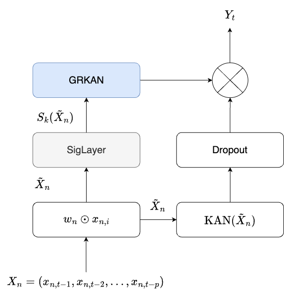

# SigKAN: Signature-Weighted Kolmogorov-Arnold Networks for Time Series



This folder includes the original code implemented for the [paper of the same name](https://arxiv.org/abs/2406.17890).

A pypi package is available at [pypi](https://pypi.org/project/sigkan/)

The SigKAN is a novel layer that combines the power of path signature and Kolmogorov-Arnold Networks.

The idea behing is to use a learnable path signature that is transformed in weights to the KAN layer.

The Signature is passed through a GRKAN (Gated Residual KAN unit) that is a modified GRN where some Dense layers are replaced by KAN layers.

The signature are computed using [iisignature_tensorflow_2](https://github.com/remigenet/iisignature-tensorflow-2/tree/main) a lightweight wrapper over the [iisignature library](https://github.com/bottler/iisignature/tree/master) to create tensorflow 2.x compatible layers for signature function with backward propagation of the gradient.

The code is implemented in tensorflow 2.x and implemnts a custom layer for the SigKAN, that takes an input tensor of shape (baatch_size, time_steps, features) and returns a tensor of shape (batch_size, time_steps, units). The layers can thus be stacked if wanted, however this is not recommended for performances reasons as the iisignature_tensorflow_2 library do not implement GPU acceleration, making made model not XLA compatible.

It is thus important to specify that jit_compile is False in the model.compile() function.

The KAN part implementation has been inspired from [efficient_kan](https://github.com/Blealtan/efficient-kan) and works similarly to it, thus not exactly like the [original implementation](https://github.com/KindXiaoming/pykan).

The SigKAN is a keras layers and can be used as any other keras layer, for example:

```python
import tensorflow as tf
from sigkan import SigKAN
model = Sequential([
    Input(shape=X_train.shape[1:]),
    SigKAN(100, 2, dropout = 0.), # 100 units, signature of order 2, takes an input shape (batch, sequence, features) and returns a tensor of shape (batch, sequence, 100)
    Flatten(),
    Dense(100, 'relu'),
    Dense(units=n_ahead, activation='linear')
])
```

A more complete example is provided in a notebook in the example folder.

The code is provided as is and is not specially maintained.

Please cite our work if you use this repo:

```
@article{inzirillo2024sigkan,
  title={SigKAN: Signature-Weighted Kolmogorov-Arnold Networks for Time Series},
  author={Inzirillo, Hugo and Genet, Remi},
  journal={arXiv preprint arXiv:2406.17890},
  year={2024}
}
```

Shield: [![CC BY-NC-SA 4.0][cc-by-nc-sa-shield]][cc-by-nc-sa]

This work is licensed under a
[Creative Commons Attribution-NonCommercial-ShareAlike 4.0 International License][cc-by-nc-sa].

[![CC BY-NC-SA 4.0][cc-by-nc-sa-image]][cc-by-nc-sa]

[cc-by-nc-sa]: http://creativecommons.org/licenses/by-nc-sa/4.0/
[cc-by-nc-sa-image]: https://licensebuttons.net/l/by-nc-sa/4.0/88x31.png
[cc-by-nc-sa-shield]: https://img.shields.io/badge/License-CC%20BY--NC--SA%204.0-lightgrey.svg
